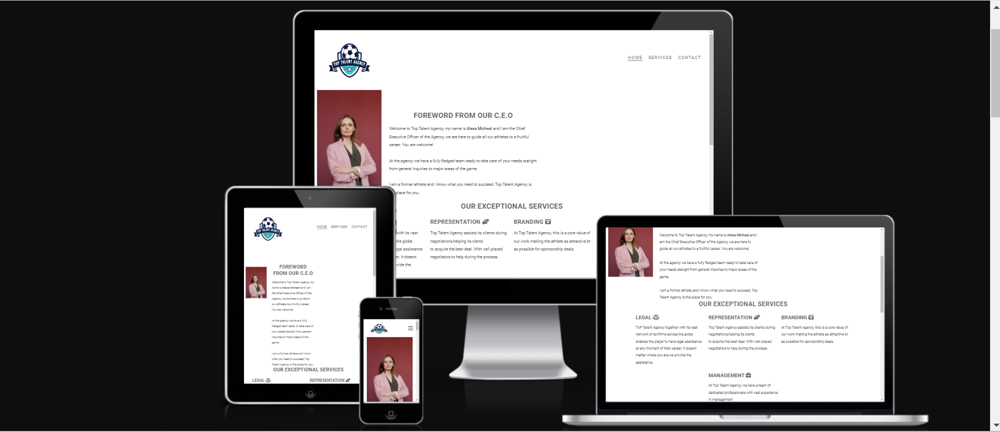
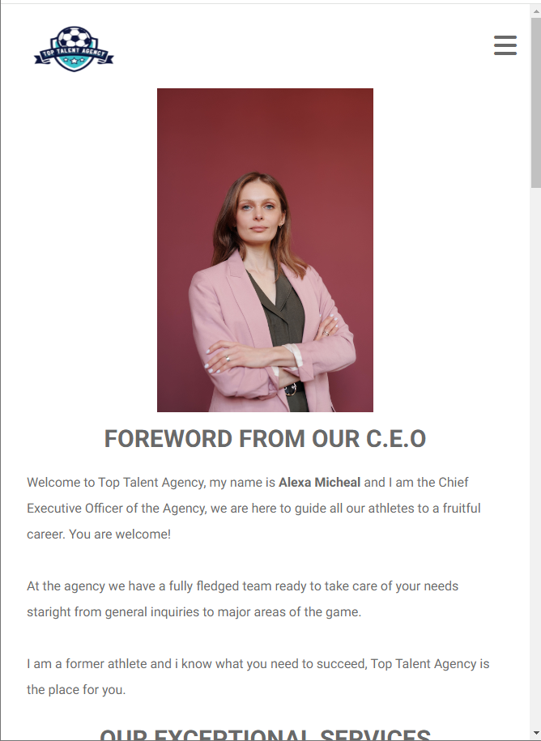
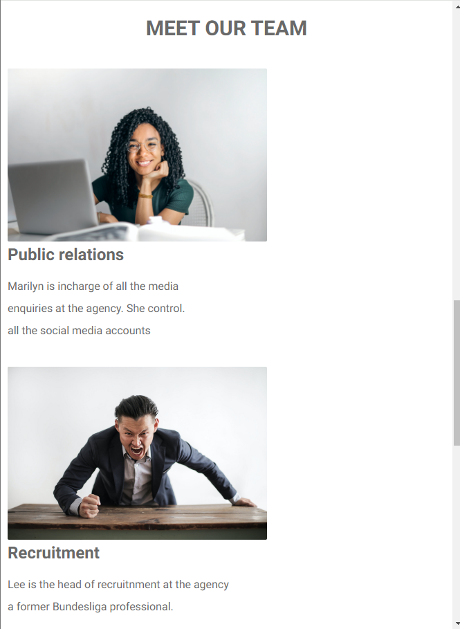
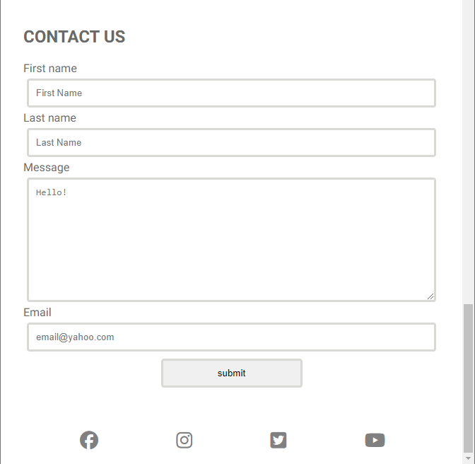
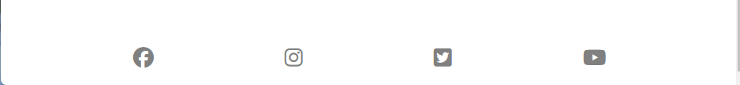
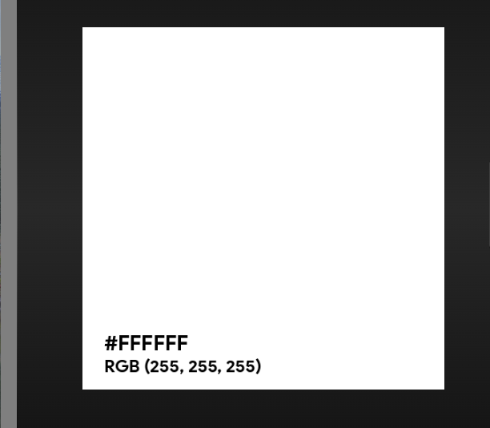
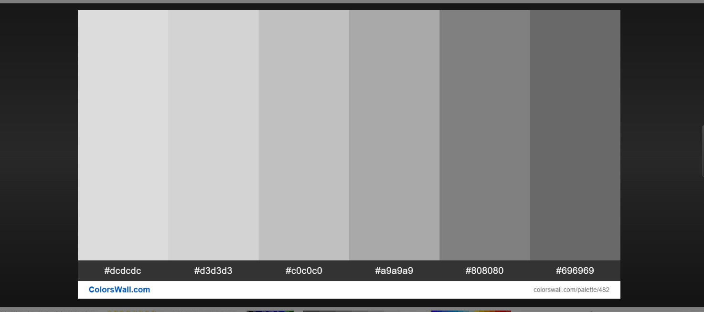

 # TOP TALENT AGENCY
This is a static website created for athletes looking for branding and management.
The website is responsive on all devices as visually illustrated below.

# Target audience
This website is dedicated to new and experienced athletes that are intrested in having an agency to manage their career. Athletes that are playing at the highest level and want to maintain that level of professionalism for a long time.

 ## Design
1. Our Project has three sections, the first part showing  the navigation and foreword from the CEO giving a brief overview of the agency.

2. Our second section has the services offered and our team. With images of the personnel behind the services an brief information about them.

3. The third part having the contact form and the social media icons. Here we have a contact form that a potential client can use to reachout to the agency.

4. We used a simple Logo to enable our website to standout.This helps to clearly give an image to the agency an standout.

5.The footer at the bottom highlights the social medias of the agency that can be accessed by clients.

## Colors used

We maintained a simple white background color and grey for the wordings. (#ffffff and rgb(105, 105, 105))

## Issues faced

#### Positiong of items.

I had issues with my positioning because some divs were not closing and therefore i had issues,i used devtools to see which divs were not closing and fixed the issue promptly.

#### 1.Early deployment.
It was important for me to do early deployment as i was able to see the output,shared the link with other friends to test on their devices and was able to solve the issue. My file paths were wrong so i had to edit them out.

## Lessons Learned

What did you learn while building this project? What challenges did you face and how did you overcome them?

Well during this project i learned that you must be creative in a way that nothing is setout, nothing is a bad idea...you just have to play around with the different things you learned untill you achieve your desired goal.

Most of ma challenges,i googled alot but also sought help from a friend  an extra mentor.

## Technologies used

1. The website is strictly made of CSS and html

2. Used git and github features aswell.

## Media

We got all our images from pexel.

## Deployment
The project was deployed on the GitHub hosting platform and below are the steps taken to achieve the feat.

1. Log into your account in github

2. Go to the repository of css-html-project

3. Click on the code button,and copy your preffered clone link.

4. Open the terminal in your code editor and change the current working directory to the location you want to use for the cloned directory.

5. Use git clone into the terminal, paste the link you copied in step 3 and press enter.

## Running Tests and validation and live link.

 W3C was used to validate the project for any errors. The project did not have any errors an was successful.

The live link can be found here;

## Credit
Images used during this project were sourced from
[readme](https://fontawesome.com)
 
The icons used in the footer section were sourced from 
[readme](https://pexels.com/sv-se/)

## Author

- [allanzizinga@yahoo.com](https://www.github.com/octokatherine)

Allan Zizinga

## 🚀 About Me
I'm a full stack developer student currently studying at Code Institute.
I come from Sweden in the city of Gothenburg.

## Feedback

If you have any feedback, please reach out to us at allanzizinga@yahoo.com

